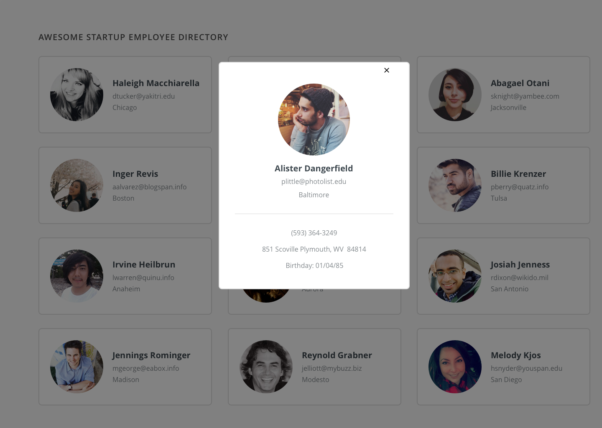
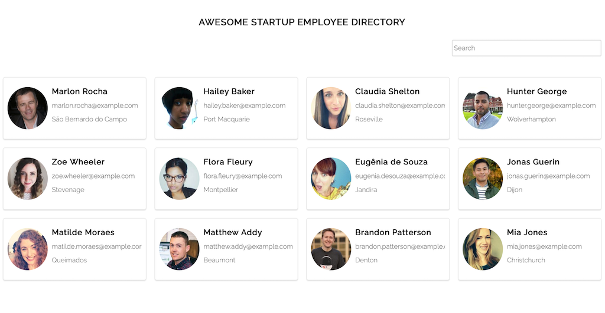

# Employee Directory Project

## Project Description

This project consumes the Random User API to generate an interactive Employee Directory for a fictitious Startup Company.

---

## Demo:

https://sidharthamishra.github.io/employee_directory/

---

## Mockups

_Employee Directory Mockup_

_Employee Modal/Overlay Mockup_

---

## Results


_Employee Directory Mobile Screenshot_


_Employee Directory Desktop Screenshot_


_Employee Modal Screenshot_

---

## Technologies Used

- HTML
- Sass/CSS
- JS
- Fetch API
- Random User Generator API (randomuser.me)
- JSON
- Chrome Dev Tools
- Postman
- VS Code
- Markdown (Documentation)

---

## Repo Structure

```
employee_directory
    |
    |
    |- css
    |   |
    |   |- vendor
    |   |      |- ionicons
    |   |          |- fonts
    |   |          |    |- ionicons.eot
    |   |          |    |- ionicons.svg
    |   |          |    |- ionicons.ttf
    |   |          |    |- ionicons.woff
    |   |          |- ionicons.css
    |   |          |- LICENSE
    |   |
    |   |- styles.css
    |   |- styles.css.map
    |
    |- img
    |   |
    |   |- mockups
    |   |    |- employee_directory.png
    |   |    |- employee_overlay.png
    |   |
    |   |- employee_directory-mobile.png
    |   |- employee_directory-modal.png
    |   |- employee_directory.png
    |
    |- js
    |   |- app.js
    |
    |- scss
    |   |- base
    |   |   |- _index.scss
    |   |   |- _normalize.scss
    |   |   |- _typography.scss
    |   |
    |   |- componenets
    |   |   |- _card.scss
    |   |   |- _grid.scss
    |   |   |- _index.scss
    |   |   |- _modal.scss
    |   |   |- _search.scss
    |   |
    |   |- utilities
    |   |   |- _index.scss
    |   |   |- _mixins.scss
    |   |   |- _variables.scss
    |   |
    |   |
    |   |- styles.scss
    |
    |- index.html
    |
    |- README.md


```

---
